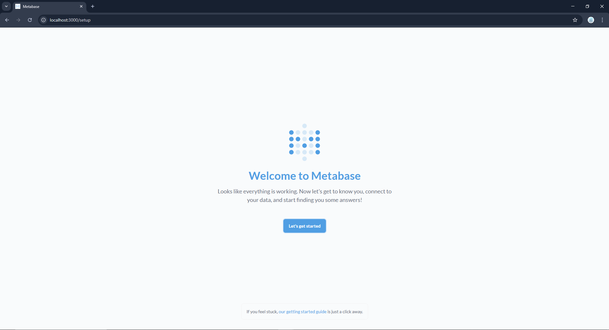

# 🐳 Tự tạo Dockerfile cho Metabase (Tối giản)

## 📌 Mục tiêu

Trong trường hợp bạn **không cần thêm plugin hoặc chỉnh sửa gì trong Metabase** nhưng vẫn muốn:
- Tự build image riêng (ví dụ đặt tên là `metabase`)
- Kiểm soát quá trình build
- Làm quen với cách dùng `Dockerfile` + `docker-compose` kết hợp

Thì bạn có thể tạo **Dockerfile tối giản** như sau 👇

---

## 🧱 Cấu trúc thư mục

```yaml
metabase-docker/
├── Dockerfile
├── docker-compose.yml
```

## 📦 Ghi chú

```yaml
metabase-docker-compose-dockerfile/
├── Dockerfile
├── docker-compose.yml
```


---

## 📄 Dockerfile

```Dockerfile
FROM metabase/metabase:latest
```

👉 Image chính thức của Metabase đã đầy đủ chức năng. Dockerfile này chỉ dùng để tạo image riêng của bạn (có thể đặt tên, lưu cache build, audit image, ...).


## 🛠 Cập nhật `docker-compose.yml`
Thay vì dùng image: `metabase/metabase`, bạn dùng `build`: để build kéo image và build container từ Dockerfile.

```yml
version: '3.8'

services:
  metabase:
    build: .
    container_name: metabase
    ports:
      - 3000:3000
    environment:
      - MB_DB_FILE=/metabase-data/metabase.db
    volumes:
      - metabase-data:/metabase-data

volumes:
  metabase-data:
```


## ▶️ Các bước thực hiện

### 1. Build & run container

```bash
docker-compose up -d --build
```

### 2. Truy cập Metabase tại:

```bash
http://localhost:3000
```

Kết quả đạt được:



## ❓Khi nào nên dùng Dockerfile riêng?

| Tình huống | Cần Dockerfile? |
|-----------|------------------|
| Dùng image gốc từ Docker Hub | ❌ Không cần |
| Thêm plugin/driver | ✅ Có |
| Chỉ muốn build image riêng kiểm soát tên/image ID | ✅ Có |
| Muốn luyện tập viết Dockerfile | ✅ Có |


## 📦 Ghi chú
- `MB_DB_FILE=/metabase-data/metabase.db` → Metabase sẽ lưu cấu hình vào file SQLite trong volume.
- Nếu dùng PostgreSQL để lưu metadata thì cần thêm service db và cấu hình `MB_DB_TYPE`, `MB_DB_HOST`, ...